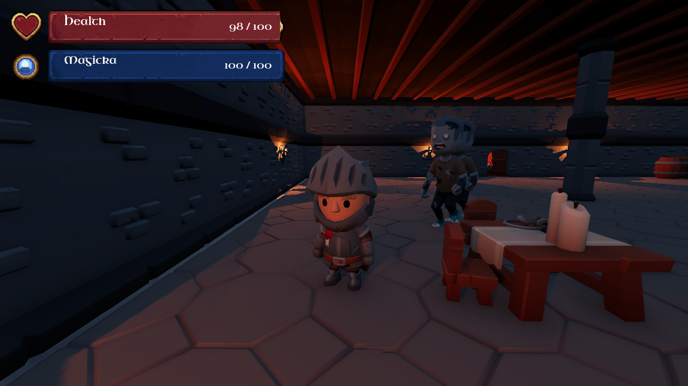
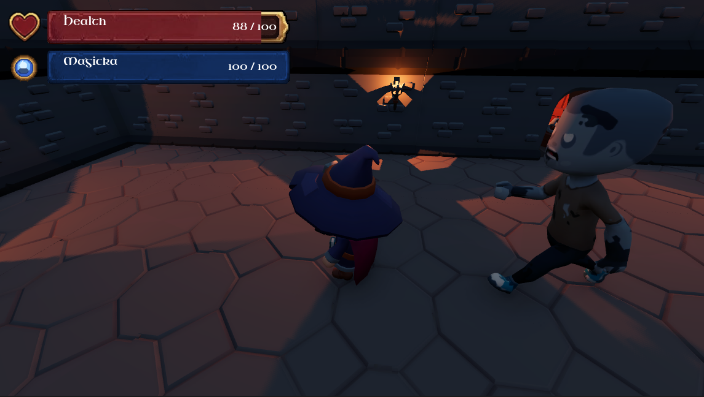

# 🏰 Dungeon Crawler Prototype (Godot 4.6)

A third-person dungeon crawler prototype built in Godot 4.6, focused on class-based gameplay, enemy encounters, and a scalable combat system.

## Overview

The game starts from a central `main.tscn` scene that loads:
- a third-person player controller
- a class selection UI
- a dungeon environment
- a HUD for health and magicka
- roaming zombie enemies

Playable characters are split into separate scenes under `Scenes/Playable`, so each class can have its own animation setup, item attachment, and later class-specific behavior.

## Current Features

- Third-person camera and movement
- Character select screen with six adventurer classes
- Shared fantasy HUD using health and magicka bars
- Zombie enemies that chase the player
- Player hurtbox and contact damage system
- Per-enemy `damage` values for easy tuning
- Class-based item sockets for held props and combat visuals
- KayKit-based character and animation setup

## Controls

- `WASD` move
- `Mouse` rotate the camera
- `Space` jump
- `Left Shift` sprint
- `ESC` release the mouse
- Click the game window to recapture the mouse

## Project Layout

- `main.tscn` - main scene that wires the whole game together
- `Addons/proto_controller` - player controller and root player scene
- `Scenes/Playable` - one scene per selectable adventurer
- `Scenes/Enemies` - enemy scenes such as the zombie
- `Scenes/UI` - HUD and character selection UI
- `Scripts` - gameplay logic for player, enemies, UI, and combat
- `Models` - imported character, enemy, prop, and animation assets
- `Assets` - UI art, fonts, and generated helper textures

## Assets Used

- https://kaylousberg.com/
- https://kenney.nl/
- Uncial Antiqua font

## 🧠 Vision

This project is a foundation for a larger dungeon crawler experience.

Planned systems include:
- Class-specific abilities and progression
- Expanded enemy AI behaviors
- Combat feedback and effects
- Deeper dungeon exploration and level design

## Notes

- Player combat is still being built out in stages.
- The current health system uses a separate `PlayerCombat` area to track contact damage cleanly.
- Enemies expose a `damage` value so future enemy types can be tuned without changing the player logic.
- Held items are attached to character hand bones so they follow the combat animation naturally.

## Run

Open the project in Godot 4.6 and run `main.tscn`.

## Credits

This project uses KayKit assets, PixelHUD UI assets, and the Uncial Antiqua font. Please respect the original asset licenses when reusing or distributing the project.

## 🎥 Preview

